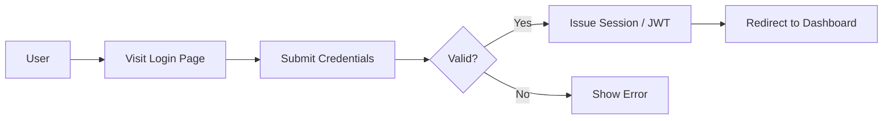
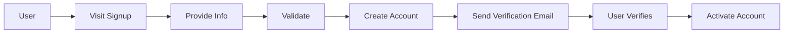
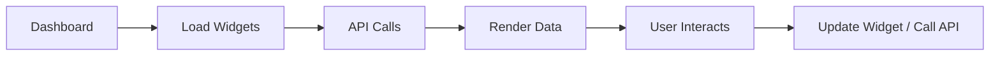
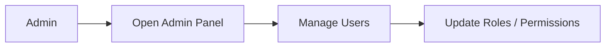

# 05 — User Flow Diagrams

## Executive Summary
Mermaid diagrams for primary user journeys. Paste into any Mermaid-enabled renderer.

## Login Flow


## Registration Flow


## Dashboard Flow


## Core Business Flow (example)


## Admin Flow

```
