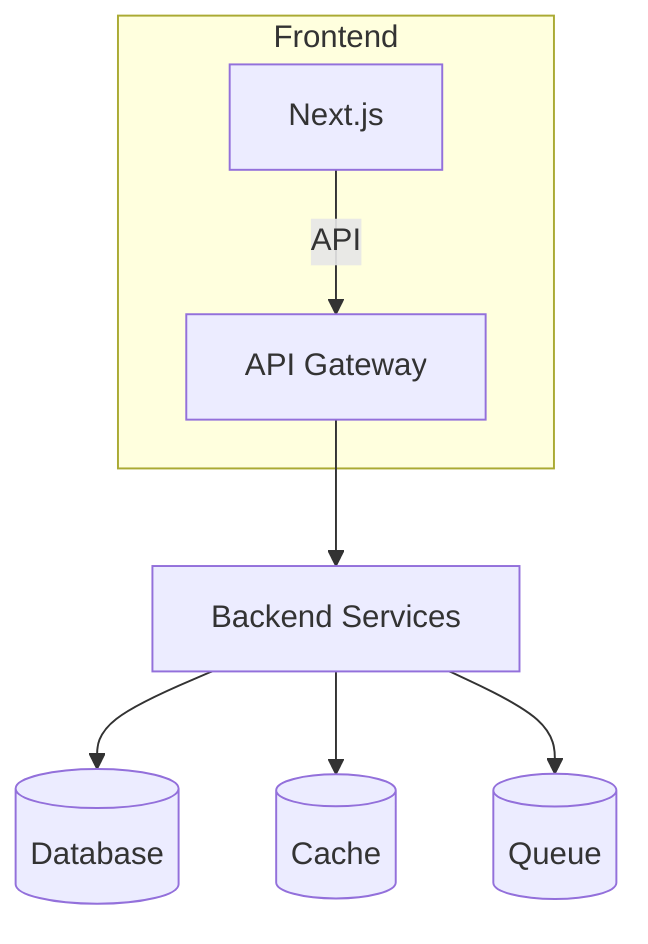

# 10 — System Architecture

## Executive Summary
Compare current architecture and propose a recommended layered architecture for Version 2.0.

## Current Architecture
- Monolithic Next.js application with server endpoints and `lib/` shared code.

## Recommended Architecture
- Frontend Layer: Next.js (app shell) or separate SPA
- Backend: Node.js services (modular service layer)
- Repository Layer: ORM (Prisma) with repository interfaces
- DB: Primary RDBMS (Postgres) + analytics warehouse
- Cache: Redis for session and query caching
- Queue: BullMQ or RabbitMQ for background jobs
- Monitoring: Sentry + Prometheus + Grafana

## Diagram (Mermaid)

