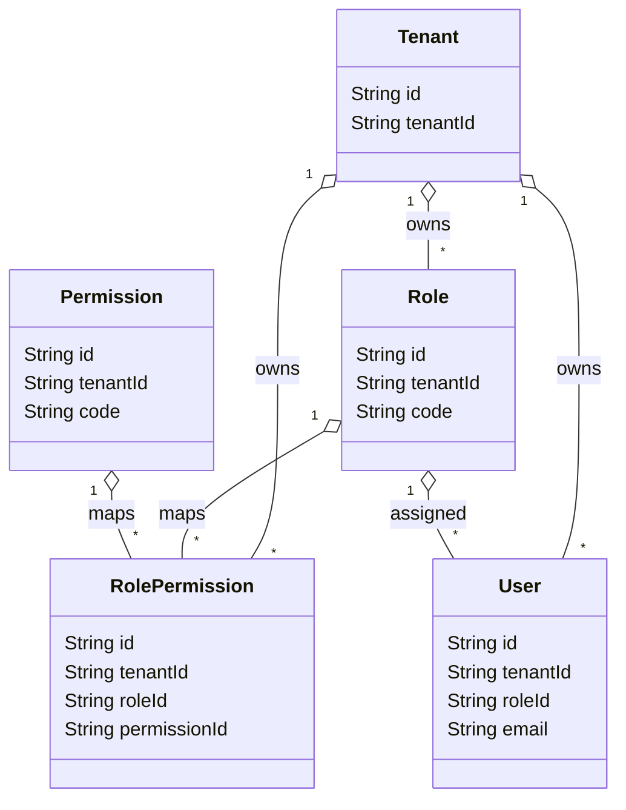
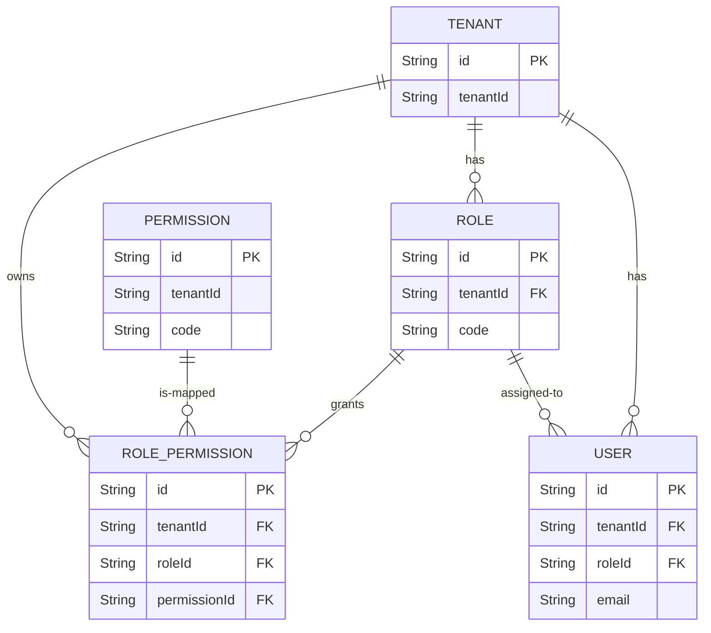

# A2 RBAC Schema Review

Date: 2026-06-01

Scope (review only)

- Models reviewed: `User`, `Role`, `Permission`, `RolePermission`, `Session` (note: `Session` model absent)
- Task: show current schema relationships, assess tenant-scoping decisions, recommend final RBAC model for MMD V2.
- No schema modifications, migrations, or implementation performed — review only.

1) Current Schema Relationships (excerpts)

- `Tenant` (key fields)
  - `id` String @id @default(cuid())
  - `tenantId` String @unique
  - relations: `users User[]`, `roles Role[]`, `auditLogs AuditLog[]`, `rolePermissions RolePermission[]` (added for relation completeness)

- `Role`
  - fields: `id`, `tenantId`, `code`, `name`, `isSystem`, timestamps
  - relation: `tenant Tenant @relation(fields: [tenantId], references: [id])`
  - relations: `users User[]`, `rolePermissions RolePermission[]`
  - indexes: `@@unique([tenantId, code])`

- `Permission`
  - fields: `id`, `tenantId` (default "system"), `code`, `module`, `action`
  - relations: `rolePermissions RolePermission[]`
  - intent: catalog/system-permission by default

- `RolePermission`
  - fields: `id`, `tenantId`, `roleId`, `permissionId`
  - relations: `tenant Tenant @relation(fields: [tenantId], references: [id])`, `role Role @relation(fields: [roleId], references: [id])`, `permission Permission @relation(fields: [permissionId], references: [id])`
  - indexes: `@@unique([roleId, permissionId])`, `@@index([tenantId])`

- `User`
  - fields: `id`, `tenantId`, `email`, `passwordHash`, `roleId`, `status`, timestamps
  - relation: `tenant Tenant @relation(fields: [tenantId], references: [id])`, `role Role @relation(fields: [roleId], references: [id])`
  - unique: `@@unique([tenantId, email])`

- `AuditLog`
  - fields: `id`, `tenantId`, `actorUserId`, `action`, `module`, `entity`, `entityId`, `changesJson`, `metadataJson`, `createdAt`
  - relation: `tenant Tenant @relation(fields: [tenantId], references: [id])`

- `Session` model: Not present in schema — session management currently handled outside Prisma or not yet implemented.

2) Entity Diagram (Mermaid)

3) Relationship Diagram (ER-style)

4) Determine whether `RolePermission` should be tenant-scoped directly

Findings:
- Current schema includes `tenantId` on `RolePermission` and an explicit `tenant` relation.
- `Role` itself is tenant-scoped (has `tenantId`). Therefore `RolePermission.tenantId` duplicates tenant ownership that is already implied by `Role -> tenant`.

Options:
- A. Keep `RolePermission.tenantId` (denormalized):
  - Pros: faster tenant-scoped queries (no join to Role), simpler indexes for tenant queries.
  - Cons: risk of inconsistency (tenantId on RolePermission must match Role.tenantId). Requires triggers/constraints or application dual-write enforcement.

- B. Remove `RolePermission.tenantId` (normalized):
  - Pros: single source of truth (Role owns tenant), no redundancy; consistency guaranteed by DB relations
  - Cons: queries that need tenant filtering will require join from RolePermission -> Role -> Tenant.

Recommendation:
- For MMD V2 (multi-tenant, correctness-first), prefer option B — remove `tenantId` from `RolePermission` and rely on `roleId` -> `Role(tenantId)` for tenant scoping. If query performance requires it later, add a computed/indexed column with strict consistency checks.

5) Determine whether `Permission` is global or tenant-scoped

Findings:
- `Permission.tenantId` currently defaults to `"system"` indicating an intent for global/catalog permissions.
- Permissions often model capabilities across the product (module+action) and are commonly global.

Recommendation:
- Treat `Permission` as global/catalog by default. Keep `tenantId` only if there is a real business need for tenant-local permissions, otherwise remove tenant scoping and enforce `Permission` as system-level entities.

6) Determine whether `User` supports single role or multi-role

Findings:
- Current `User` model includes `roleId` (single role per user).

Options:
- Single role (current): simpler, easier to implement, suitable for many SaaS apps.
- Multi-role: more flexible, supports varying responsibilities, requires `UserRole` join table and updated authorization logic.

Recommendation:
- For MMD V2, prefer supporting multi-role eventually, but ship with single-role for A2 if timebox demands simplicity.
- Path forward:
  1. Short-term (A2 initial): Keep single-role to limit scope.
  2. Medium-term: Add `UserRole` join table and update Auth/session logic + UI to allow multiple roles per user. Migrate existing `roleId` into `UserRole` entries during that transition.

7) Recommended Final RBAC Model for MMD V2

Principles:
- Permissions: global catalog (system-level). Maintained in `Permission` table.
- Roles: tenant-scoped. Each Role belongs to one Tenant and groups a set of Permissions.
- RolePermission: map Role -> Permission (do NOT duplicate tenantId). Tenant ownership of RolePermission inferred via Role.
- Users: support single Role for initial A2 release; design schema and services to accommodate multi-role migration.
- Sessions: implement a `Session` model (not present) containing `id`, `userId`, `tenantId`, `expiresAt`, `refreshTokenHash` for session management and auditing.

Schema recommendations (summary):
- `Permission`: remove `tenantId` or keep as `String @default("system")` but enforce `system` for catalog entries. Prefer `tenantId` absent for clarity.
- `RolePermission`: drop `tenantId` field and relation; keep `roleId`, `permissionId` with unique constraint `@@unique([roleId, permissionId])`.
- `User`: refactor later to `UserRole` for multi-role; for now, keep `roleId` and ensure service-level checks.
- `AuditLog`: keep tenant-scoped as-is; include actor metadata.
- Add `Session` model with `tenantId` to track effective tenant for session-scoped RBAC.

8) Risks

- Removing `tenantId` from `RolePermission` requires migration/backfill and code updates; risk of temporary inconsistencies during rollout.
- Treating `Permission` as global may limit per-tenant customization unless the product intends to support tenant-local permissions.
- Moving from single-role to multi-role requires careful migration of existing `roleId` values and updating auth checks.
- Performance: eliminating `tenantId` denormalization may add joins; ensure indexes on `roleId` and `permissionId` are in place.

9) Final Recommendation

- Status: A2 Blocked
  - Reason: RBAC model decisions require one final change before unblocking A2: remove redundant `tenantId` from `RolePermission` (or add consistency constraints) and confirm `Permission` scope (global vs tenant-local). These decisions affect schema, migrations, and application logic.

- Recommended next steps to unblock A2:
  1. Decide `Permission` scope (global preferred). Document and approve.
  2. Decide treatment of `RolePermission.tenantId`:
     - Preferred: remove field; plan dev-only migration and tests as per `docs/TENANT_FK_CORRECTION_PLAN.md`.
     - Alternate: keep and add DB CHECK/trigger to enforce equality with `Role.tenantId`.
  3. Choose short-term `User` role strategy (keep single-role for A2; schedule multi-role migration in roadmap).
  4. Add `Session` model design and implement in A2 once RBAC decisions finalized.

If you approve these decisions, I can produce the precise schema-change plan and development-only migration scripts for the chosen path (remove `RolePermission.tenantId` and treat `Permission` as global)."}
