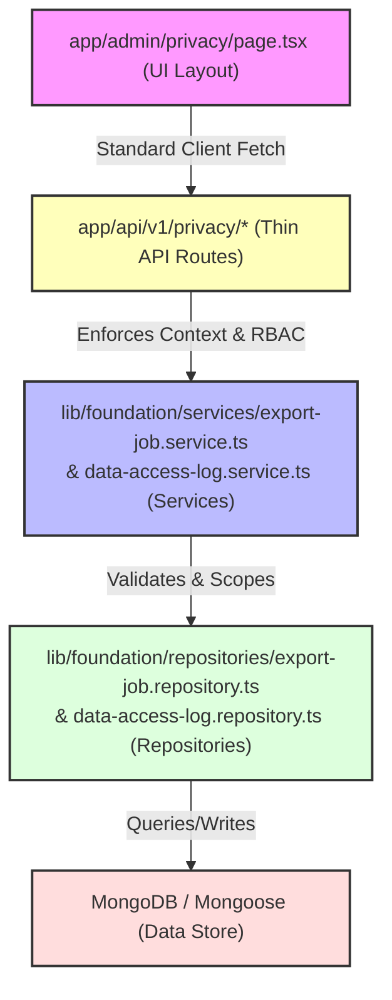

# Privacy & Governance Architecture Analysis — A3.5

Date: 2026-06-01
Status: COMPLETE

This analysis documents the exact architectural layer and multi-tenant isolation violations discovered within [app/admin/privacy/page.tsx](file:///c:/Ravi/MY%20WORKS/MMD%20V2/app/admin/privacy/page.tsx).

---

## 1. Current Imports (Page Level)

The page currently imports database connection helpers, raw Mongoose database models, and service classes directly into the presentation layer:

```typescript
// app/admin/privacy/page.tsx
import { auth } from '@/lib/auth'
import { revalidatePath } from 'next/cache'
import connectDB from '@/lib/db/mongodb'               // VIOLATION: UI → Database Connection
import DataAccessLog from '@/lib/db/models/DataAccessLog' // VIOLATION: UI → Database Model
import ExportJob from '@/lib/db/models/ExportJob'         // VIOLATION: UI → Database Model
import { ExportService } from '@/lib/services/export.service' // VIOLATION: UI → Service
import { ExportFormatSchema } from '@/lib/validators/common'
import { redirect } from 'next/navigation'
```

---

## 2. Current Database Access

Within the Server Component rendering block (`PrivacyCenterPage`), raw database queries are executed directly during the Next.js page generation lifecycle:

```typescript
// Lines 93-129
try {
  await connectDB() // Bypasses Route, Service, and Repository layers

  // Direct MongoDB read with sorting, limiting, and mongoose lean operations
  const rawLogs = await DataAccessLog.find().sort({ createdAt: -1 }).limit(100).lean()
  
  // Direct MongoDB read populating mongoose refs across model boundaries
  const rawGdprJobs = await ExportJob.find({ entityType: 'GDPR_PORTABILITY' })
    .sort({ createdAt: -1 })
    .limit(25)
    .populate('requestedBy', 'name email')
    .lean()
  ...
}
```

---

## 3. Current Service Calls

Within the server action function (`requestGdprExport`), the presentation layer calls the legacy `ExportService` directly to orchestrate business actions and create database records:

```typescript
// Lines 45-76
async function requestGdprExport(formData: FormData) {
  'use server'
  ...
  try {
    // VIOLATION: Direct Service layer query & side-effect execution inside UI
    await ExportService.createJob(
      { id: session.user.id, role: session.user.role },
      {
        entityType: 'GDPR_PORTABILITY',
        format: parsedFormat.data,
        filter: {
          scope: 'CANDIDATE_DATA_PORTABILITY',
          requestedByRole: session.user.role,
        },
      }
    )
    ...
  }
}
```

---

## 4. Current Tenant Handling & Isolation Risks

Multi-tenant scoping is **completely absent** in the current privacy auditing logic:

1. **Global Scopes**: The queries `DataAccessLog.find()` and `ExportJob.find()` pull records globally across the entire MongoDB cluster, returning logs and export items belonging to all users and workspaces.
2. **Missing `tenantId` in Schema**: Neither the `DataAccessLog` nor `ExportJob` Mongoose schemas (nor the MongoDB `User` model) define a `tenantId` field.
3. **Cross-Tenant Data Exposure**: While access is gated behind role checks (`SUPER_ADMIN` and `ADMIN`), an administrator in one tenant can view raw data access logs and export file URLs belonging to users of other tenants, violating multi-tenant boundary compliance rules.

---

## 5. Remediation Target Architecture

We will restructure this feature to achieve complete compliance with the mandatory `UI → API Route → Service → Repository → Prisma/Database` flow:



* **No direct Mongoose imports in UI.**
* **Tenant Isolation enforced**: Operations resolve user context `x-tenant-id` and filter results so that users can only fetch logs and exports belonging to their active tenant context.
* **Repositories & Services created** in `lib/foundation/` following standard core patterns.
