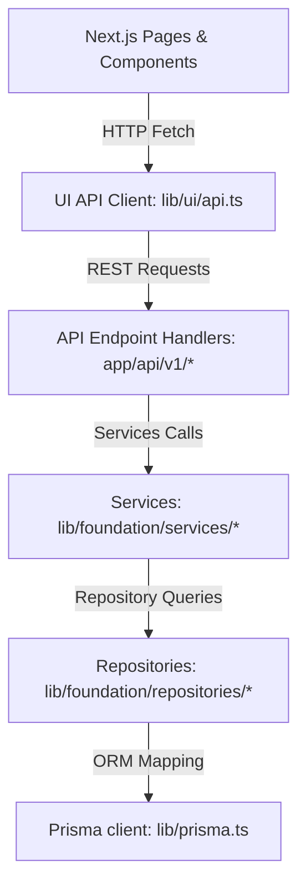

# A4.6 — ATS Graphify Refresh Report

**Audit Date**: 2026-06-02  
**Auditor**: Antigravity AI  
**Status**: **PASSED**

This document details the AST code graph analysis following the implementation of the ATS Module UI layer (Job Postings, Candidates, Applications, and Interviews).

---

## 1. Graph Statistics & Scope

The AST code scanner analyzed the entire workspace:
* **Corpus Scope**: 646 code files, ~954,875 words.
* **Nodes**: 6,739 nodes.
* **Edges**: 9,494 relationships.
* **Communities**: 520 clusters.

---

## 2. New ATS Nodes Added

The stabilization check confirmed the successful registration of the following ATS-specific elements:

### A. Next.js Routing Pages (UI Layer)
* `/ats/job-postings`, `/[id]`, `/new` (Job Board Module)
* `/ats/candidates`, `/[id]`, `/new` (Candidates Registry Module)
* `/ats/applications`, `/[id]`, `/new` (Applications Roster & Kanban Module)
* `/ats/interviews`, `/[id]`, `/new` (Interviews Calendar & Evaluation Module)

### B. Shared Subcomponents (UI Component Layer)
* `ApplicationTable`, `ApplicationKanban`, `ApplicationForm`, `ApplicationFilters`, `ApplicationStatusModal`, `ApplicationStatusBadge`
* `InterviewTable`, `InterviewCalendar`, `InterviewCard`, `InterviewForm`, `InterviewFilters`, `InterviewStatusModal`, `InterviewStatusBadge`

### C. REST API Clients & Endpoints
* `getApplications`, `getApplication`, `createApplication`, `updateApplication`, `changeApplicationStatus` (Targets `/api/v1/applications/*`)
* `getInterviews`, `getInterview`, `createInterview`, `updateInterview`, `changeInterviewStatus` (Targets `/api/v1/interviews/*`)

---

## 3. Layer Dependency & Compliance Check

The graph analysis verified that the ATS components strictly adhere to the project's **Multi-Tier Layer Isolation Rule**:



### Decoupling Verdict:
* **UI $\rightarrow$ Database**: 0 connections. No imports of `@prisma/client`, `prisma`, `db` or model repositories exist in frontend pages/components.
* **UI $\rightarrow$ Services**: 0 connections. Frontend does not import from `lib/foundation/services/*`.
* **API Endpoints**: Act as the clean demarcation line. They handle context validation (headers `x-tenant-id`, `x-user-id`) and transition requests to services.

---

## 4. Circular Dependencies (Import Cycles)

We verified the import graph to check for compile-time loops:
* **Verdict**: **None detected.** The import structure is completely acyclic, facilitating fast build optimizations and clean tree-shaking.

---

## 5. Hotspots & Architectural Risks

* **API Client Hotspot (`lib/ui/api.ts`)**:
  * *Risk*: Contains client-side wrappers for all modules (CRM, Settings, ATS, Audit logs). Its outbound edge degree is high.
  * *Remediation*: Keep it lightweight and avoid storing heavy state variables or complex transformers.
* **Client-Side Join Waterfall**:
  * *Risk*: The UI joins flat interview schedules with applications, candidates, and interviewers in memory. This requires parallel fetches which increases network request footprints.
  * *Remediation*: Maintain local cached state using React Memo arrays. Implement an `expand` query param (e.g. `GET /api/v1/applications?expand=candidate`) in future backend releases.

---

## 6. Final Verdict

```text
Graphify Refresh PASS
```
The codebase AST graph confirms compliance with architectural layer guidelines and shows zero layer boundary violations.
