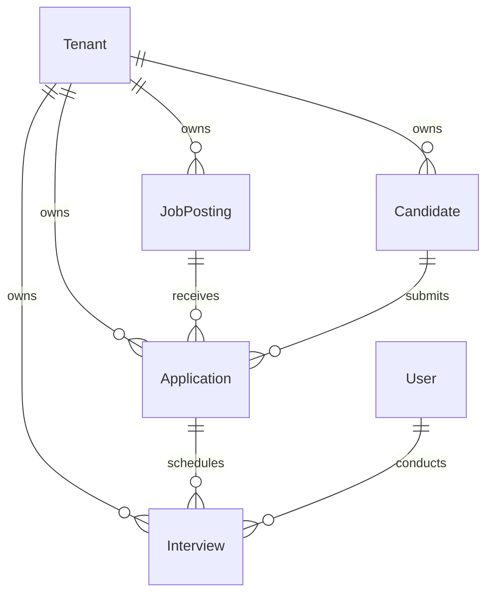

# ATS Database Schema Analysis — A4 Step 1

Date: 2026-06-01
Status: COMPLETE

This analysis outlines the database architecture, entity relations, index scoping, and schema isolation parameters for the new **Applicant Tracking System (ATS)** foundation module. 

---

## 1. Schema Entity Inventory

We will introduce 3 new enums and 4 new database models to the Prisma PostgreSQL database:

### Enums
1. **`JobPostingStatus`**: Tracks position lifecycles (`DRAFT`, `OPEN`, `CLOSED`, `ON_HOLD`).
2. **`ApplicationStatus`**: Tracks candidate funnel lifecycles (`APPLIED`, `SCREENING`, `SHORTLISTED`, `INTERVIEW`, `OFFERED`, `HIRED`, `REJECTED`, `WITHDRAWN`).
3. **`InterviewStatus`**: Tracks individual interview events (`SCHEDULED`, `COMPLETED`, `CANCELLED`, `NO_SHOW`).

### Models
1. **`JobPosting`**: Represents open job requisitions.
2. **`Candidate`**: Represents active and passive applicants.
3. **`Application`**: Relational junction connecting a `Candidate` to a `JobPosting`.
4. **`Interview`**: Relational entity tracking interview rounds, scheduling, interviewers, and feedback ratings.

---

## 2. Relationship Map & FK Ownership

All relationships are designed with strict referential integrity rules:

### Foreign Key Ownership Definitions
* **`JobPosting.tenantId`** ➔ `Tenant.id` (Many-to-One): Direct tenant ownership.
* **`Candidate.tenantId`** ➔ `Tenant.id` (Many-to-One): Direct tenant ownership.
* **`Application` Relationships**:
  * `Application.tenantId` ➔ `Tenant.id` (Many-to-One): Direct tenant ownership.
  * `Application.jobPostingId` ➔ `JobPosting.id` (Many-to-One): Connects application to posting.
  * `Application.candidateId` ➔ `Candidate.id` (Many-to-One): Connects application to candidate.
* **`Interview` Relationships**:
  * `Interview.tenantId` ➔ `Tenant.id` (Many-to-One): Direct tenant ownership.
  * `Interview.applicationId` ➔ `Application.id` (Many-to-One): Tracks round under application scope.
  * `Interview.interviewerId` ➔ `User.id` (Many-to-One): Maps the conductor to the SQL User registry.

---

## 3. Multi-Tenant Scoping & Indexing Strategy

To maintain strict tenant isolation and guarantee high query performance under index scans:

1. **`Tenant.id` References Only**: Every ATS model references `Tenant.id` via the foreign key column `tenantId` (String). No references are made to the business identifier `Tenant.tenantId` to comply with lock down governance.
2. **Index Scopes**:
   * All models define `@@index([tenantId])` to accelerate workspace lookup.
   * `Candidate` defines `@@index([tenantId, email])` to allow fast email searches and lookup checks.
   * `Application` defines `@@index([jobPostingId])` and `@@index([candidateId])` to resolve candidate profiles and job lists.
   * `Interview` defines `@@index([applicationId])` and `@@index([interviewerId])` to optimize scheduling views and calendar populators.

---

## 4. Soft-Delete Design

To support logical row archiving and prevent accidental data loss:
* Every ATS model defines `deletedAt DateTime?` (nullable timestamp).
* Active queries must automatically check `{ deletedAt: null }`.
* Hard deletes are strictly prohibited; soft deletes are performed by updating `deletedAt` to the active timestamp.
* Each model defines `@@index([deletedAt])` to ensure fast index filtering on active records.
