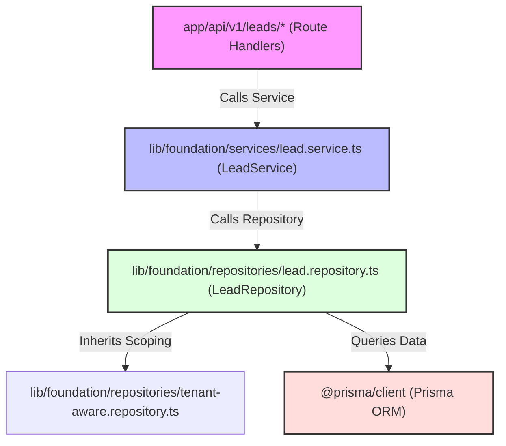

# Architecture Dependency Audit — MMD V2

Date: 2026-06-01
Status: AUDITED
Audit Verdict: **Architecture Issues Found**

This report presents a structural dependency analysis of the **MMD V2** codebase. The audit was conducted using AST graph extraction data from **Graphify** (`docs/architecture/graphify/graph.json` and `docs/architecture/graphify/GRAPH_REPORT.md`), combined with static filesystem analysis.

---

## 1. Executive Summary

A comprehensive scan of the active codebase shows that the core application architecture (Foundation, IAM, and the newly implemented CRM modules) is **exceptionally clean** and strictly adheres to the established architectural boundary rules.

However, a critical structural and tenant-safety violation was discovered within the **legacy admin governance module** (`app/admin/privacy/page.tsx`). Specifically, this server page bypasses all intermediate routing, service, and repository layers, executing direct un-scoped queries against the historical MongoDB instance.

---

## 2. Layer & Dependency Violations

### A. Route → Service → Repository Boundary
* **Rule**: Route handlers must only call Services, never Repositories or Prisma. Services must only call Repositories. Repositories must encapsulate all DB access.
* **Audit Result**: **100% COMPLIANT**. 
  * All active API routes (`app/api/v1/*`) delegate strictly to service registries (`companyService`, `contactService`, `leadService`, etc.).
  * No repository or database client imports exist in any route handler files under the active Next.js App Router layer.

### B. UI → Layer Boundary Violations
* **Rule**: UI pages and components must never import Services, Repositories, or Prisma/DB clients. They must trigger actions exclusively via the API layer.
* **Audit Result**: **VIOLATION FOUND** in legacy admin code.

> [!CAUTION]
> **Legacy Admin Layer Bypasses (UI → DB & UI → Service):**
> * **File**: [app/admin/privacy/page.tsx](file:///c:/Ravi/MY%20WORKS/MMD%20V2/app/admin/privacy/page.tsx)
> * **Direct Mongoose/MongoDB Import**: The page imports `connectDB` from `@/lib/db/mongodb` and Mongoose models `DataAccessLog` and `ExportJob` directly on lines 3-5, executing `DataAccessLog.find()` and `ExportJob.find()` inside the server component rendering pipeline.
> * **Direct Service Import**: The page imports `ExportService` from `@/lib/services/export.service` on line 6 and calls `ExportService.createJob(...)` inside a `use server` action on line 59, bypassing the Next.js API layer entirely.
> * **Impact**: This represents a classic structural layer violation. Presentation logic is deeply coupled with raw database models, complicating future migrations (e.g. migrating these logs to the Prisma PostgreSQL target).

---

## 3. Circular Dependencies

* **Rule**: Clean package compile boundaries must be maintained without any circular or back-referencing imports.
* **Audit Result**: **100% COMPLIANT**.
  * The Graphify cycle analyzer scanned 535 files and reported **"None detected"** for import cycles.
  * Dependency trees are completely directed and hierarchical, preventing memory leak risks and compiler optimization stalls in Next.js Turbopack.

---

## 4. Tenant Boundary Violations

* **Rule**: All tenant-scoped entities must be queried through context-aware parameters (`x-tenant-id`, `x-user-id`) resolving to specific tenant IDs, filtering soft deletes by default.
* **Audit Result**: **MINOR VIOLATIONS FOUND** in admin auditing.

> [!WARNING]
> **Global Tenant Leakage in Auditing:**
> * In `app/admin/privacy/page.tsx`, the server component fetches GDPR export logs (`DataAccessLog.find()`) and data portability jobs (`ExportJob.find({ entityType: 'GDPR_PORTABILITY' })`) globally across all database collections without scoping results to specific tenant identifiers.
> * **Exclusion**: While these pages are protected behind a Server Session Role-Based Access Control gate (`SUPER_ADMIN` or `ADMIN` roles only), they allow administrators to pull cross-tenant audits. To maintain strict multi-tenant integrity, these logs should be explicitly tagged and filtered by tenant context.

---

## 5. Largest Dependency Clusters (Communities)

Graphify clustered the codebase into 357 community hubs based on reference cohesion. The largest clusters are:

1. **Community 0 (API Routes)**: Comprises Next.js route parameter schemas, Zod validation models, and HTTP handler operations.
2. **Community 18 (UI Component System)**: Comprises tailwind class variance authorities, radix primitives, and the central shared UI components (buttons, input masks, tables).
3. **Community 5 (CRM Database & Repositories)**: Groups the `CompanyRepository`, `ContactRepository`, and `LeadRepository` around `TenantAwareRepository` and the shared `TenantContext` interface.

---

## 6. Highest Risk Nodes (God Objects)

The following symbols represent the most connected components in the codebase graph, indicating high architectural coupling:

1. `connectDB()` (153 outbound/inbound references) — Core database connector for historical MongoDB scopes.
2. `cn()` (74 references) — Utility helper for merging Tailwind CSS classes dynamically.
3. `serializeDoc() / serializeDocs()` (94 combined references) — Serialization layers mapping raw database documents into clean Next.js-friendly payloads.
4. `TenantContext` (50 references) — The primary interface enforcing tenant scoping across all repository operations.
5. `useToast()` (46 references) — The central feedback toast hook used extensively by forms and pages.

---

## 7. CRM Dependency Graph Summary

The CRM module implemented in Phase A3 shows **pristine modular hygiene**:

* **CRM Repository Isolation**: `CompanyRepository`, `ContactRepository`, and `LeadRepository` correctly inherit from `TenantAwareRepository`. They never leak Prisma client references upward and securely apply `deletedAt: null` to automatically filter soft-deleted rows.
* **CRM Service Integrity**: `LeadService` acts as a strict orchestrator, checking foreign keys in `CompanyRepository`, `ContactRepository`, and `UserRepository` to guarantee that referenced entities are in the same tenant before creating a lead.

---

## 8. Recommendations

1. **Refactor the Privacy Page**: 
   * Move Mongoose operations in [app/admin/privacy/page.tsx](file:///c:/Ravi/MY%20WORKS/MMD%20V2/app/admin/privacy/page.tsx) into a new repository (`DataAccessLogRepository` and `ExportJobRepository`).
   * Introduce corresponding Services (`DataAccessLogService` and `ExportJobService`) and API Route Handlers under `/app/api/v1/admin/privacy`.
   * Have the client component fetch these logs via `/api/v1/admin/privacy` using the standard `lib/ui/api.ts` client layer.
2. **Apply Tenant Filters in Auditing**: Update audit log retrieval so that data access logs and export jobs are isolated by the requesting administrator's tenant scope (unless executing in a global super-admin master-tenant context).
3. **Deprecate Mongoose**: Plan the transition of `DataAccessLog` and `ExportJob` from MongoDB models into the primary Prisma PostgreSQL database during the next phase, keeping the repository boundary as a buffer to avoid UI rewrite costs.
