# MMD V2 Consolidated Project Closure Report

This report provides a comprehensive, chronological, and structural summary of all requests, accomplishments, validation states, and remaining launch tasks for the **MMD V2** platform.

---

## 1. Chronology of User Requests & Tasks

The project progressed through two major security and launch-readiness gates:

### Gate 1: RC-3 — Tenant Context Hardening Remediation
* **Goal**: Eliminate security vulnerability **HEADER-1** (trust in client-supplied `x-tenant-id` / `x-user-id` headers) and resolve **AUTH-1** (defense-in-depth API route validation gap).
* **Requirements**:
  - Implement idempotent seeding of the `system` tenant and `admin@magnuscopo.com` in PostgreSQL.
  - Harden NextAuth cookies by caching PostgreSQL-resolved `tenantId` and `userId` claims in the JWT payload at sign-in.
  - Create a centralized server-side `getAuthenticatedTenantContext()` helper.
  - Refactor all 27 endpoint handlers under `/api/v1/**` to extract context from the session and ignore client headers.
  - Upgrade the integration test suite to execute credentials-based sign-in, session switching, and header spoofing validations.

### Gate 2: V1 Launch Closure — Deployment, Documentation & Commercial Readiness Audit
* **Goal**: Assess the platform's readiness for production release.
* **Requirements**:
  - Audit CRM completion status, deployment configurations, error monitoring, and database backup routines.
  - Evaluate existing developer documentation versus operational playbooks and end-user guides.
  - Analyze product packaging, pricing models, demo environments, and sales assets.
  - Deliver detailed operational, documentation, and commercial reports, along with a final launch checklist and release verdict.

---

## 2. Completed Remediations & Accomplishments

All requested security hardening and auditing tasks have been fully executed:

### A. Database Seeding & Seeding Hardening
* **Seeded PostgreSQL**: Configured `prisma/seed.ts` to automatically create the `super_admin` role and map `admin@magnuscopo.com` to the `system` tenant.
* **Idempotency**: Implemented `upsert` queries to prevent duplicate entries and database unique constraint violations on successive seed runs.

### B. Authentication & Session Hardening
* **JWT Claims Mapping**: NextAuth JWT callback queries PostgreSQL once during initial credentials verification to resolve the user's `tenantId` and Postgres `userId`, caching them in the secure session cookie.
* **Database Verification Guard**: MongoDB-authenticated users are rejected with `403 Forbidden` if their email is not present in PostgreSQL (no auto-provisioning).
* **Centralized Context Service**: Created `lib/core/tenant-context.ts` to fetch and validate the session context immutably from NextAuth.

### C. API Endpoint Hardening
* **Unified Security Context**: Removed all references to `request.headers.get('x-tenant-id')` and `x-user-id` across **all 27 API route handlers** under `/api/v1/**`.
* **Zero Header Trust**: Every route handler now relies strictly on the session-derived context, eliminating header-spoofing attack vectors.

### E. Integration Test Suite Upgrades
* **Stateful Auth**: Configured `ats.spec.ts` to login via NextAuth `/api/auth/callback/credentials` using seeded database credentials (`interviewer-a@example.com` / `interviewer-b@example.com`).
* **Session Switching**: Programmatically switches active request cookies in Playwright to simulate different tenant sessions within a single test.
* **Spoof Validation**: Asserts that injecting manual spoofed headers (`x-tenant-id`) fails to bypass context resolution:
  - Tenant A reads their own data successfully even if they pass a Tenant B header.
  - Tenant B receives `404 Not Found` when trying to read Tenant A's data, regardless of the headers sent.

---

## 3. Current System Validation State

The codebase has been fully verified and is compile-ready:

* **Database Seed** (`npm run db:seed:prisma`): **PASS** (completed successfully with no duplicate records).
* **TypeScript Typecheck** (`npm run typecheck`): **PASS** (0 compiler errors).
* **ESLint Linting** (`npm run lint`): **PASS** (0 errors, 23 warnings regarding unused variables/imports).
* **Integration Tests** (`npx playwright test tests/integration/ats.spec.ts`): **PASS** (5/5 tests passed).
* **Production Build** (`npm run build`): **PASS** (Next.js compiled successfully in 18.2 seconds, optimizing all 77 app routes).

---

## 4. Launch Readiness Audit Findings

Our readiness audit revealed several critical gaps that block a public SaaS release but permit a controlled pilot:

### A. CRM Completion Status (Database Fragmentation)
* **Status**: **PARTIALLY READY**
* **Finding**: The database repository and service files for CRM (`Company`, `Contact`, `Lead`) are fully implemented in the PostgreSQL foundation layer. However, the frontend dashboard actions (`module3-company.ts` and `module9-leads.ts`) are still wired to the MongoDB-based services. Standalone "Contacts" page is missing.

### B. Deployment & Backup Readiness
* **Status**: **BLOCKED FOR PUBLIC RELEASE**
* **Finding**: Standalone Docker Compose containers are fully operational. However, there are no automated database backup cron jobs or restore scripts checked into the repository, blocking disaster recovery readiness.

### C. Documentation Readiness
* **Status**: **PARTIALLY READY**
* **Finding**: System architectures and OpenAPI specs are highly detailed. However, user-facing help guides, onboarding procedures, and operational runbooks are missing.

### D. Commercial Packaging & Pricing
* **Status**: **PARTIALLY READY**
* **Finding**: The entitlements framework supports multi-tenant flags and is seeded. However, tiered pricing models (Standard/Professional/Enterprise) and Stripe payment integrations are missing (checkout and billing must be managed manually).

---

## 5. Final Verdict & Next Steps

### Verdict

```text
V1 READY FOR PILOT
```

* **Justification**: All critical security vulnerabilities have been remediated (HEADER-1 and AUTH-1 are verified resolved). The system compiles, builds, and passes its E2E test suites cleanly. It is fully ready for a controlled customer pilot where backups and billing can be handled manually. It is not ready for a public multi-tenant SaaS release due to hybrid database fragmentation and missing operations runbooks.

---

## 6. Remaining Effort to General Release

To achieve V1 general public release readiness, the remaining tasks are estimated at **14 Days** of engineering and operational effort:

```mermaid
gantt
    title Remaining Effort to V1 General Release
    dateFormat  D
    axisFormat %d
    section Migration
    PostgreSQL UI Action Wiring :active, 0, 5d
    section Operations
    Automated Backup Setup      : 5, 7d
    Operational Runbooks        : 7, 11d
    section Commercial
    Pricing Tier Setup          : 11, 14d
```



1. **CRM PostgreSQL Refactoring** (5 Days): Refactor dashboard actions to query the PostgreSQL foundation services instead of MongoDB.
2. **Automated Backup Scripts** (2 Days): Configure automated database cron dump tasks with offsite storage mapping.
3. **Operations Runbooks** (4 Days): Draft restore playbooks, secret rotation runbooks, and end-user support manuals.
4. **Commercial Pricing Tiers** (3 Days): Define and seed commercial plan tiers and document manual tenant onboarding flows.
