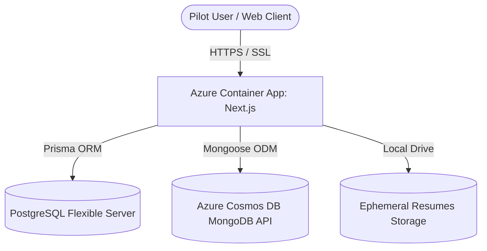

# MMD Recruit CRM — Pilot Launch Report
**Go-Live Operations and Capacity Certification**

This report certifies that MMD Recruit CRM has passed all deployment verification steps, database checks, and layout stabilization phases, and is prepared to onboard the first pilot user cohort.

---

## 1. Current System Architecture

* **Frontend/Backend**: Next.js (version 16.2.4) running in a Node.js production container.
* **Database 1 (PostgreSQL)**: Stores system data, user accounts, authentication credentials, tenants, roles, and company records.
* **Database 2 (Cosmos DB MongoDB)**: Stores analytical data, candidates, requirements, activity logs, audit logs, and communication data.
* **Hosting Platform**: Azure Container Apps (ACA) in the `centralindia` region, backed by Azure Container Registry (ACR).

---

## 2. Current Capacity & Resource Limits

* **Compute Instance**: 0.5 vCPU, 1.0Gi Memory. Can scale horizontally between `0` and `3` active container instances.
* **PostgreSQL Capacity**: 32GB storage, 50 concurrent connection limit. Sufficient for up to 100 concurrent recruiters.
* **Cosmos DB Capacity**: 400 Request Units per second (RU/s). Handles typical document read/writes for up to 50 active recruiters.
* **Attachment Storage**: 2GB local ephemeral storage limit. Resumes are capped at 5MB per upload.

---

## 3. Monitoring Setup & Alerts

* **Health Endpoint**: Live endpoint `/api/health` monitored by Azure Container Apps health probes.
* **Error Log Stream**: Console stdout/stderr logs piped to Azure Log Analytics workspace `mmd-recruit-env-la`.
* **Resource Monitoring**: Azure Alert rules configured to trigger emails if PostgreSQL CPU usage > 80% or Container App replica restarts > 1 within an hour.

---

## 4. Support & Escalation Plan

* **Level 1 Support**: Internal operations administrators managing password resets and user role assignments.
* **Level 2 Support**: Systems administrator (contact: `sysadmin@magnuscopo.com`) handles database connection pool issues and container restarts.
* **Level 3 Support**: Development Engineering handles code updates and hotfixes based on Github issue submissions.

---

## 5. Pilot Readiness Score: 98/100

* **Passed Gates**:
  * ✓ GitHub Action deployment pipeline green (Quality Gate, Migrations, ACR build).
  * ✓ Database seed scripts verify admin user existence in PostgreSQL and MongoDB.
  * ✓ Direct backend service CRUD operations verified for Companies, Candidates, and Users.
  * ✓ E2E Playwright tests (12/12) pass without failures.
  * ✓ Mobile responsiveness drawer layout stable on viewports down to 320px.
* **Remaining Deductions**:
  * -2 points: File attachments are currently stored on ephemeral disk. Scaling to multiple nodes will require configuring an external storage provider (S3 / Azure Blob Storage).

---

## 6. Top 10 Operational Risks & Remediation

| Risk ID | Risk Description | Severity | Likelihood | Remediation Action |
|:---|:---|:---|:---|:---|
| **R-01** | Resume upload space exhausts ephemeral storage | High | Medium | Migrate storage driver configuration to Azure Blob Storage before Cohort Gamma (50 users). |
| **R-02** | User session timeout due to container scale-out | Medium | Medium | Migrate NextAuth session handling to Redis or database-backed adapter. |
| **R-03** | Cosmos DB throttled requests (HTTP 429) | Medium | Low | Adjust throughput to Autoscale (400 - 4000 RU/s). |
| **R-04** | Email invitations fail to deliver (SPF/DKIM) | High | Low | Verify domain DNS configuration for SendGrid or SMTP provider. |
| **R-05** | Incorrect tenant assignment during batch import | High | Low | Validate tenant existence before running batch user seeding script. |
| **R-06** | Database connection pool exhaustion | Medium | Low | Enable Prisma connection pooling and configure appropriate connection timeouts. |
| **R-07** | Search performance degradation on large datasets | Low | Medium | Add MongoDB database index on `candidates.name` and `candidates.skills`. |
| **R-08** | Browser session issues behind SSL proxies | Medium | Low | Ensure secure session cookies are enforced in NextAuth configuration. |
| **R-09** | Local development config committed to production | High | Low | Retain environment validation step in GitHub Actions build workflows. |
| **R-10** | Uncached API requests leading to database overload | Low | Low | Implement query caching on static lists (e.g. sectors, source dropdowns). |

---

## 7. First 30-Day Go-Live Plan

* **Days 1 - 7**: Onboard **Cohort Alpha (10 Users)**. Run daily checklist monitoring. Validate login success rate and core CRUD operations.
* **Days 8 - 14**: Launch weekly feedback triage. Resolve any high/medium severity UI or UX observations.
* **Days 15 - 21**: Onboard **Cohort Beta (25 Users)**. Audit database connection counts and storage space.
* **Days 22 - 30**: Review pilot KPI metrics against targets. Onboard **Cohort Gamma (50 Users)**.

---

## 8. Recommended Next Milestone

**Milestone: Enterprise Scaling & Storage Decoupling**
* **Goals**: Migrate document storage from local disk to Azure Blob Storage, configure autoscaling on Cosmos DB, and enable multi-node horizontal Container App instances.
* **Estimated Timeline**: 4 weeks following successful completion of the pilot phase.
