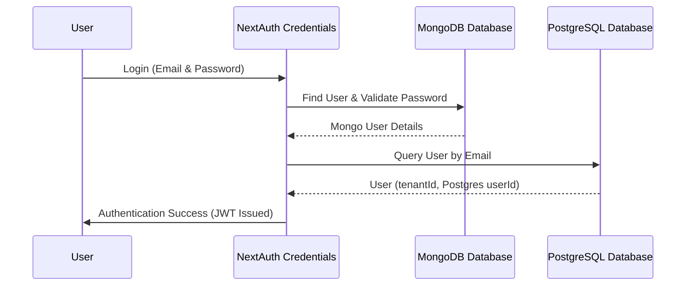

# RC-3 Authentication Hardening Report

## JWT Changes
* Added typing properties `tenantId?: string` and `userId?: string` to NextAuth Token object.
* The callback resolves `tenantId` and `userId` from the Postgres database only when `user` is defined (during initial user sign-in/callback callback flow).
* Caches both properties inside NextAuth JWT payload, avoiding redundant database lookups on future calls to `auth()`.

## Session Changes
* Added typing properties `tenantId?: string` and `userId?: string` to NextAuth Session User object.
* Configured the `session()` callback to map `tenantId` and `userId` from the JWT token to the session User object, making it available on all server-side calls to `auth()`.

## Sign-in Flow

## Rejected User Flow
* If a user credentials successfully match a MongoDB user record, but the corresponding user email is NOT found in the PostgreSQL `User` table, the `jwt` callback throws an error: `Unauthorized: User not found in database`.
* NextAuth cancels the authentication flow and redirects the user to the default NextAuth login/error page.
