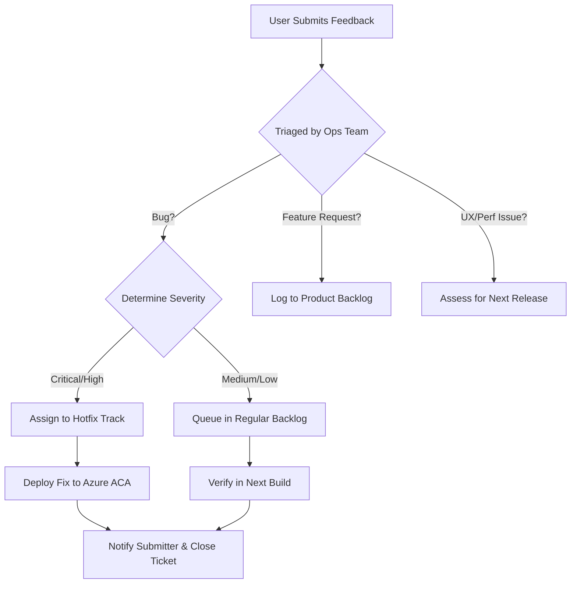

# MMD Recruit CRM — User Feedback Process
**Pilot User Operations Phase**

This document establishes the workflow to capture, classify, and address bugs, feature requests, UX observations, and performance feedback submitted by pilot users.

---

## 1. Feedback Channels

Pilot users can submit feedback through the following mechanisms:
1. **In-App Feedback Button**: Submits details directly to the `analyticsevents` collection in MongoDB.
2. **Dedicated Support Email**: Submissions sent to `pilot-feedback@magnuscopo.com`.
3. **Weekly Pilot Check-in Calls**: Operations team compiles UX observations directly from user interviews.

---

## 2. Ingestion Template

Every feedback ticket must capture:
* **Submitter Email / Role**: Who encountered the issue.
* **Tenant ID**: The tenant environment of the user.
* **Type**: [Bug | Feature Request | UX Issue | Performance Issue]
* **Summary**: Clear description of the behavior.
* **Steps to Reproduce (Bugs)**: Click-by-click instructions.
* **Browser / OS**: Mobile vs. Desktop resolution.
* **Severity**: [Critical | High | Medium | Low]

---

## 3. Severity Classification & SLA Matrix

All feedback is reviewed daily and categorized into one of four severity levels:

| Severity | Criteria | Example | Resolution Target |
|:---|:---|:---|:---|
| **Critical** | Major system failure. Blocks core business operations. Security breach or data loss. | - Authentication redirect loop - CRUD operations throw server errors (e.g., CastError/BSONError) - Tenant data leaks | **Immediate Hotfix** (Within 4 hours) |
| **High** | Core feature is broken but a workaround exists. Significant UX regressions. | - Mobile sidebar does not close, obstructing 40% of the screen - Candidate list fails to load for specific queries | **Within 24 Hours** |
| **Medium** | Minor feature failure. UX flows are non-intuitive. | - Search bar returns results but does not highlight matches - Dashboard graphs display incorrect labels | **Next Sprint Release** (Within 7 days) |
| **Low** | Aesthetic tweaks, cosmetic issues, or new feature enhancements. | - Logo padding feels narrow - Request to add an export-to-PDF button for resumes | **Backlogged** (Under Review) |

---

## 4. Triage Workflow

---

## 5. Feedback Backlog Management

* **Location**: Maintain a shared Kanban board (GitHub Projects or Jira) with sections:
  * **Inbox / Triage**: Unreviewed feedback.
  * **Backlog**: Approved tickets waiting for scheduling.
  * **In Progress**: Active engineering fixes.
  * **QA / Verification**: Verifying fixes on local / staging environments.
  * **Closed / Released**: Merged and deployed to live Azure environment.
