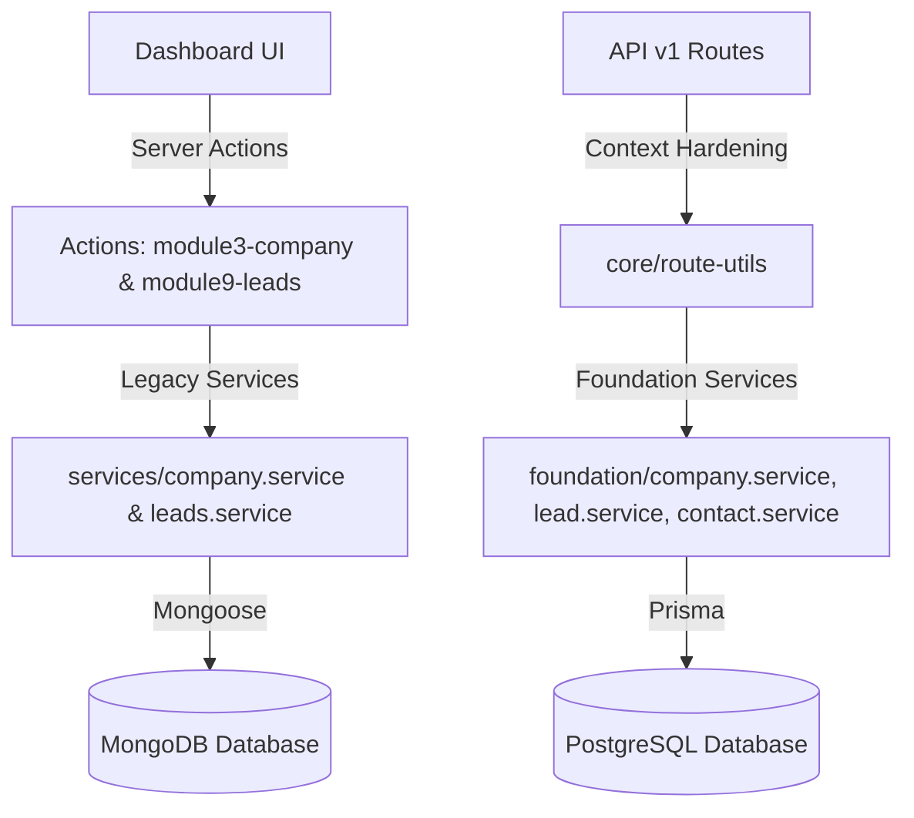

# V1 CRM Architecture Audit Report

This report documents the architectural audit of the CRM module in the MMD V2 codebase, identifying database fragmentation, data flows, and integration gaps.

---

## 1. Current CRM Data Flow

The CRM module currently operates on a hybrid/split architecture:

* **Dashboard UI**: Queries and writes to **MongoDB** via Next.js Server Actions.
* **API Route Handlers** (`/api/v1/**`): Query and write to **PostgreSQL** via foundation services.

---

## 2. Legacy MongoDB Paths

The following files define MongoDB operations for the CRM domain:

* **Actions**:
  - `lib/actions/module3-company.ts` (Wired to legacy `CompanyService`)
  - `lib/actions/module9-leads.ts` (Wired to legacy `LeadsService`)
* **Services**:
  - `lib/services/company.service.ts` (CRUD on Mongoose `Company` and `HRContact` models)
  - `lib/services/leads.service.ts` (CRUD on Mongoose `Lead` model)
* **Models**:
  - `lib/db/models/Company.ts`
  - `lib/db/models/HRContact.ts`
  - `lib/db/models/Lead.ts`

---

## 3. PostgreSQL Foundation Paths

The following files define the target PostgreSQL repository pattern for multi-tenant isolation:

* **Repositories**:
  - `lib/foundation/repositories/company.repository.ts`
  - `lib/foundation/repositories/contact.repository.ts`
  - `lib/foundation/repositories/lead.repository.ts`
* **Services**:
  - `lib/foundation/services/company.service.ts`
  - `lib/foundation/services/contact.service.ts`
  - `lib/foundation/services/lead.service.ts`
* **Prisma Schema**:
  - `model Company`
  - `model Contact`
  - `model Lead`

---

## 4. Broken Integrations & Fragmentation

1. **Split Data State**: 
   - Operations performed via the dashboard UI do not write to or read from PostgreSQL.
   - Operations performed via public API routes do not write to or read from MongoDB.
   - This results in isolated datasets (e.g. companies created via the UI cannot be linked to Job Postings/Requirements in PostgreSQL).
2. **Contact Entity Disconnection**:
   - The PostgreSQL `Contact` table remains empty because the UI creates contacts embedded as `hrContacts` in MongoDB.
3. **No Contacts UI**:
   - There are no dashboard routes or pages to list, view, edit, or delete contacts directly in a tenant-scoped manner.
