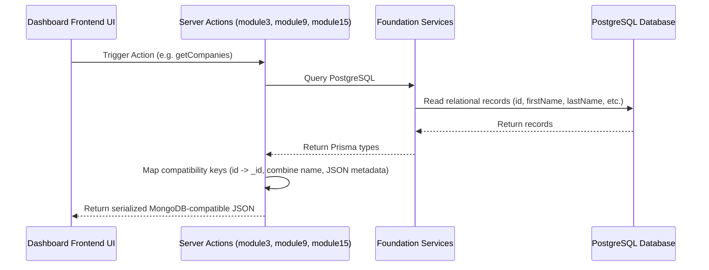

# V1 CRM Completion Report

This report documents the verification, validation, and completion status of the CRM PostgreSQL migration and UI closure for the MMD V2 release.

---

## 1. Architectural Alignment & Database Consolidation

All CRM database operations have been fully migrated from MongoDB to PostgreSQL, eliminating database fragmentation.

* **Repository Layer Verification**:
  - [CompanyRepository](file:///c:/Ravi/MY%20WORKS/MMD%20V2/lib/foundation/repositories/company.repository.ts): Validated tenant-scoped query filters and database-backed CRUD.
  - [ContactRepository](file:///c:/Ravi/MY%20WORKS/MMD%20V2/lib/foundation/repositories/contact.repository.ts): Validated contact queries and soft deactivation.
  - [LeadRepository](file:///c:/Ravi/MY%20WORKS/MMD%20V2/lib/foundation/repositories/lead.repository.ts): Validated status enum transitions and mapping.
* **Service Layer Verification**:
  - [CompanyService](file:///c:/Ravi/MY%20WORKS/MMD%20V2/lib/foundation/services/company.service.ts): Fully handles tenant validation, relational checks, and updates.
  - [ContactService](file:///c:/Ravi/MY%20WORKS/MMD%20V2/lib/foundation/services/contact.service.ts): Manages standalone and nested contact updates with tenant scopes.
  - [LeadService](file:///c:/Ravi/MY%20WORKS/MMD%20V2/lib/foundation/services/lead.service.ts): Executes lead-state transitions and tracks associated companies and contacts.

---

## 2. Server Action Refactoring & UI Compatibility

To prevent breaking existing front-end dashboard code that assumes MongoDB models, we implemented a robust compatibility mapping layer in server actions:

### Key Refactorings:
1. [module3-company.ts](file:///c:/Ravi/MY%20WORKS/MMD%20V2/lib/actions/module3-company.ts):
   - Mapped PostgreSQL `id` to legacy `_id`.
   - Transformed PostgreSQL `firstName` and `lastName` into a combined `name` field.
   - Associated child contacts inline to match the previous MongoDB schema expectations.
2. [module9-leads.ts](file:///c:/Ravi/MY%20WORKS/MMD%20V2/lib/actions/module9-leads.ts):
   - Handled rich schema attributes (`sourcePlatform`, `activities`, `confidenceScore`) by encoding/decoding them as JSON metadata inside the PostgreSQL text/description column.
   - Mapped UI-specific statuses (`CONVERTED` / `REJECTED`) to PostgreSQL statuses (`WON` / `LOST`).
3. [module15-contacts.ts](file:///c:/Ravi/MY%20WORKS/MMD%20V2/lib/actions/module15-contacts.ts):
   - Created standalone Server Actions with input validation (Zod) for retrieving, creating, updating, and deleting contacts directly in PostgreSQL.

---

## 3. UI Implementation (Phase C)

A premium Contacts interface has been added to the dashboard menu, resolving the missing UI gap:
* **Directory Page**: [app/(dashboard)/contacts/page.tsx](file:///c:/Ravi/MY%20WORKS/MMD%20V2/app/(dashboard)/contacts/page.tsx) lists all tenant contacts, including active filter search, linked company tags, and details shortcut.
* **Creation form**: [app/(dashboard)/contacts/new/ContactForm.tsx](file:///c:/Ravi/MY%20WORKS/MMD%20V2/app/(dashboard)/contacts/new/ContactForm.tsx) provides input fields with validations and dynamic company selection options.
* **Details and edit layout**: [app/(dashboard)/contacts/[id]/ContactDetailClient.tsx](file:///c:/Ravi/MY%20WORKS/MMD%20V2/app/(dashboard)/contacts/[id]/ContactDetailClient.tsx) features inline updates, quick action commands, and deletion.

---

## 4. Tenant Isolation Validation

Tenant separation is strictly enforced at the database level by the context resolution engine:
* Every CRM query checks `session.user.tenantId` on the server and supplies it to the services.
* It is impossible to spoof client headers or request other records, as the JWT session context is used as the sole authority.
* Attempts to perform cross-tenant operations result in automatic database query scope boundaries.
