# V1 Final Release Decision

## 1. Final Verdict

```text
V1 READY FOR PILOT
```

---

## 2. Release Summary & Justification

Following the successful execution of the RC-3 Security Hardening phase, MMD V2 is deemed **Ready for a Controlled Production Pilot**.

### Security & Hardening (Verified)
* **Vulnerability HEADER-1**: Resolved. Tenant context resolution is securely derived from encrypted NextAuth session claims. Spoofed headers are ignored.
* **Vulnerability AUTH-1**: Resolved. Direct authentication checks are implemented within every API route handler.
* **Build Integrity**: Clean. ESLint passes with zero errors, `tsc --noEmit` compiles with zero errors, and Next.js builds successfully.
* **E2E Testing**: Green. Playwright tests pass (5/5), including the hardened Multi-Tenant Isolation suite.

### Pilot-Ready (Yes)
* The application runs correctly in containerized environments (Docker Compose) and supports a controlled pilot with a single-tenant or guided setup where data fragmentation (hybrid Mongo/Postgres) can be managed.

### Release-Blocked (No Public SaaS Release Yet)
* The application cannot be launched for general public multi-tenant SaaS because of database fragmentation (CRM/Operations are still wired to MongoDB in the UI, rather than the Postgres foundation layer), missing automated database backups, and lack of commercial payment/pricing setup.

---

## 3. Remaining Effort to General Release

To transition MMD V2 from a controlled Pilot to a general public SaaS Release, the following tasks must be completed:

```mermaid
gantt
    title Remaining Effort to V1 General Release
    dateFormat  D
    axisFormat %d
    section Migration
    PostgreSQL UI Action Wiring :active, 0, 5d
    section Operations
    Automated Backup Setup      : 5, 7d
    Operational Runbooks        : 7, 11d
    section Commercial
    Pricing Tier Setup          : 11, 14d
```



| Task Group | Description | Effort (Days) |
| --- | --- | --- |
| **PostgreSQL CRM Migration** | Refactor frontend dashboard actions (`module3-company.ts` and `module9-leads.ts`) to query the PostgreSQL foundation services instead of MongoDB. | 5 days |
| **Automated Backups** | Implement script cron jobs for daily Postgres and MongoDB dumps with automated offsite retention. | 2 days |
| **Operations Runbooks** | Write step-by-step restore playbooks, secret rotation manuals, and troubleshooting runbooks for on-call engineers. | 4 days |
| **Pricing & Plans** | Define and seed tiered pricing plans (Standard/Professional/Enterprise) and implement customer onboarding guides. | 3 days |
| **Total Remaining Effort** | **Full V1 Release Readiness** | **14 Days** |
