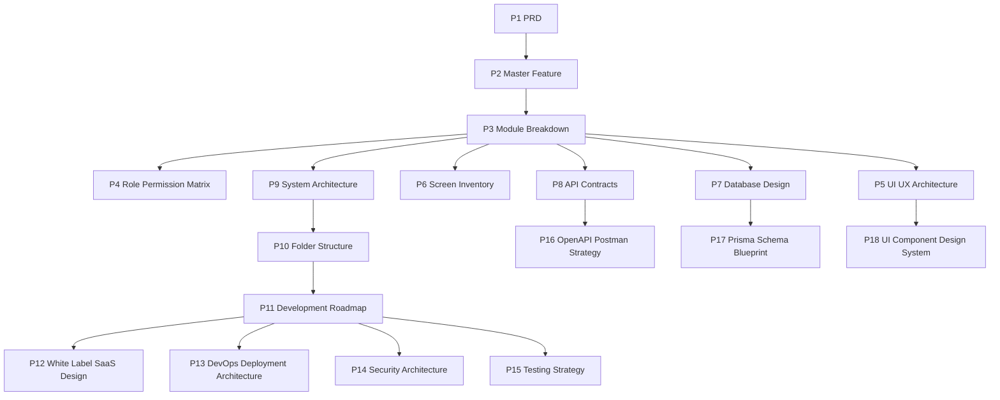

# MMD V2 Phase Graph

This file graphifies the phase documentation into implementation sequencing and dependency flow.

## Recommended Build Start (Per Master Instruction)
1. Tenant
2. User
3. Role
4. Permission
5. Company
6. Contact
7. Lead
