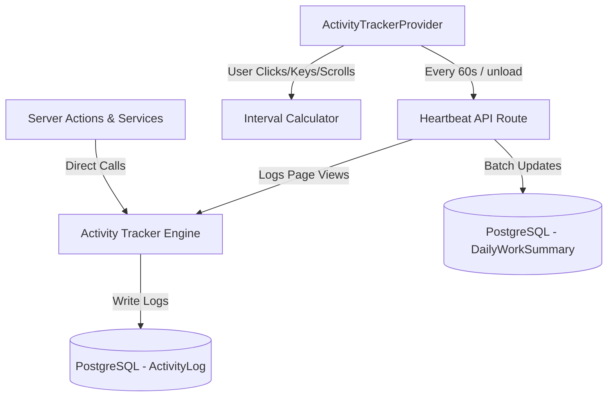

# Work Intelligence Platform — Activity Tracking Architecture

This document describes the design, database model, and technical architecture of the automated **Work Intelligence Platform** implemented in V1.8.

---

## 1. Architectural Overview

The Work Intelligence Platform completely replaces manual timesheet logging with a background event-capture engine. The system is split into three layers:
1. **Central Tracking Engine (Server)**: A unified helper (`trackActivity()`) that logs structured actions to the database and maintains daily aggregates.
2. **Client-Side Active Time Engine**: A React context provider (`ActivityTrackerProvider`) that monitors user interaction (clicks, scrolls, typing, and route changes) and aggregates active/idle periods.
3. **Heartbeat Synchronization API**: A lightweight REST endpoint (`/api/productivity/heartbeat`) that receives batched client interaction metrics and performs upsert operations on daily summaries.

---

## 2. Database Schema Design (Prisma)

Two models are defined in [schema.prisma](file:///c:/Ravi/MY%20WORKS%20MMD%2520V2/prisma/schema.prisma) to store tracking data with strict tenant isolation:

### `ActivityLog`
Captures low-level business mutations and page views chronologically.
* `id` (CUID): Primary key.
* `tenantId` (String): Tenant partition identifier.
* `userId` (String): User identifier.
* `module` (String): Feature area (e.g., `ATS`, `CRM`, `HR`, `SYSTEM`).
* `entityType` (String): Target record type (e.g., `Lead`, `Candidate`, `Page`).
* `entityId` (String, Optional): Target identifier.
* `action` (String): Event type (e.g., `CREATE_REQUIREMENT`, `PAGE_VIEW`, `LOGIN`).
* `metadata` (Json, Optional): Extended details (e.g., IP address, browser type, path).
* `createdAt` (DateTime): Event timestamp.

### `DailyWorkSummary`
Maintains daily running performance metrics for reporting.
* `id` (CUID): Primary key.
* `tenantId` (String): Tenant partition identifier.
* `userId` (String): User identifier.
* `date` (DateTime): Calendar date set to UTC midnight.
* `loginHours` (Float): Total duration logged in.
* `activeHours` (Float): Running count of active minutes.
* `idleHours` (Float): Running count of idle minutes.
* `totalActions` (Int): Total counter of mutation/view events.
* `productivityScore` (Float): Calculated as `(activeHours / (activeHours + idleHours)) * 100`.

---

## 3. Client-Side Active Time Engine

Located in [ActivityTrackerProvider.tsx](file:///c:/Ravi/MY%20WORKS/MMD%20V2/components/providers/ActivityTrackerProvider.tsx), this component handles non-intrusive session auditing:
* **Listeners**: Subscribes to global window events (`mousedown`, `keydown`, `scroll`, `touchstart`).
* **Idle State Trigger**: If 10 minutes pass without user input, the state switches to `idle`, stopping active timer accumulation.
* **Batching**: Accumulates active seconds, idle seconds, and page view paths in local state.
* **Synchronization**: Pushes metrics to the heartbeat API route every 60 seconds or upon window unload (`beforeunload`).

---

## 4. Heartbeat Sync Route

Located at [route.ts](file:///c:/Ravi/MY%20WORKS/MMD%20V2/app/api/productivity/heartbeat/route.ts):
* Processes active/idle increments.
* Uses Prisma transactions to handle high-frequency upserts.
* Automatically recalculates the `productivityScore` ratio in real time:
  $$\text{Productivity Score} = \min\left(100, \text{round}\left(\frac{\text{Active Hours}}{\text{Active Hours} + \text{Idle Hours}} \times 100\right)\right)$$
